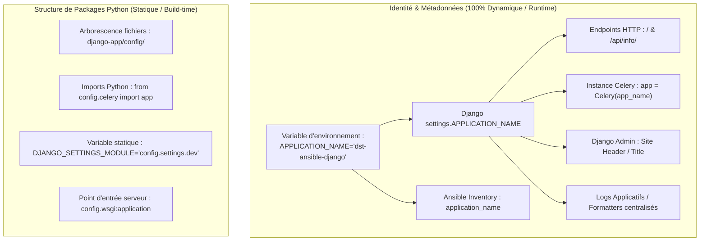

# Analyse Technique — Variabilisation du Nom Global de l'Application Django (`APPLICATION_NAME`)

## 1. Contexte & Objectifs

Dans le cadre du projet `django-postgresql-redis-celery-docker-compose`, la configuration applicative respecte les préceptes des **Twelve-Factor Apps** (notamment le *Facteur III : Config*). Actuellement, les métadonnées globales de déploiement et de versioning sont pilotées par des variables d'environnement explicites :

```env
APPLICATION_ENV=dev
APPLICATION_VERSION=0.0.0-dev
APPLICATION_COMMIT=local
```

Cependant, le **nom d'identité global de l'application** (`"datascientest-ansible-django"`) demeure codé en dur à plusieurs endroits stratégiques :
- Dans les endpoints de santé et d'informations système (`GET /` et `GET /api/info/`).
- Dans l'initialisation de l'instance Celery (`Celery("datascientest_django")`).
- Dans les assertions de validation Ansible (`playbooks/validate.yml`) et les scripts E2E (`validate_stg_like_e2e.py`, `validate_dev_full_e2e.py`).
- Dans les tests unitaires Django (`tests/test_health.py`).

### Objectif Cible
Introduire la variable d'environnement **`APPLICATION_NAME`**, initialisée par défaut à **`"dst-ansible-django"`** (au lieu de `"datascientest-ansible-django"`), tout en offrant une surcharge dynamique complète par environnement (dev, stg, prod) sans modifier le code source.

---

## 2. Distinction Architecturale : Identité vs Code Source Python

Lors de la conteneurisation d'une application Django, il est crucial d'établir une frontière nette entre deux concepts :



### Règle d'or architecturale :
- **Ne jamais tenter de renommer dynamiquement les répertoires de packages Python sur disque** (`config/`, `manage.py`, `health/`, etc.) au runtime d'un conteneur. Les chemins d'importation Python (`sys.path`) et les points d'entrée WSGI/ASGI (Gunicorn/Uvicorn) doivent rester prévisibles et immuables dans l'image Docker.
- **Variabiliser intégralement l'identité fonctionnelle et opérationnelle** de l'application via `APPLICATION_NAME`, injectée dès le fichier `.env` ou l'inventaire Ansible, puis propagée dans les paramètres Django (`settings.APPLICATION_NAME`), les endpoints d'observabilité, l'instance Celery et les validations.

---

## 3. Cartographie Complète des Fichiers & Composants Impactés

### 3.1. Composant Django (`django-app/`)

#### 1. `django-app/config/settings/base.py`
Déclarer la variable `APPLICATION_NAME` via `django-environ` avec la valeur par défaut convenue `"dst-ansible-django"` :
```python
APPLICATION_NAME = env("APPLICATION_NAME", default="dst-ansible-django").strip()
APPLICATION_ENV = env("APPLICATION_ENV", default=_settings_environment).strip().lower()
APPLICATION_VERSION = env("APPLICATION_VERSION", default="0.0.0-dev")
APPLICATION_COMMIT = env("APPLICATION_COMMIT", default="local")
```

#### 2. `django-app/health/views.py`
Substituer la chaîne codée en dur par `settings.APPLICATION_NAME` dans les réponses JSON des endpoints :
```python
@require_GET
def home(request):
    return JsonResponse(
        {
            "application": getattr(settings, "APPLICATION_NAME", "dst-ansible-django"),
            "status": "running",
        }
    )

@require_GET
def info(request):
    return JsonResponse(
        {
            "application": getattr(settings, "APPLICATION_NAME", "dst-ansible-django"),
            "environment": getattr(settings, "APPLICATION_ENV", "dev"),
            "version": getattr(settings, "APPLICATION_VERSION", "0.0.0-dev"),
            "commit": getattr(settings, "APPLICATION_COMMIT", "local"),
            "runtime": "gunicorn",
            "database": "postgresql",
            "broker": "redis",
            "async_runtime": "celery",
            "scheduler": "django-celery-beat",
        }
    )
```

#### 3. `django-app/config/celery.py`
Dynamiser le nom de l'application Celery tout en assainissant les tirets en underscores pour respecter la convention d'identifiant Python :
```python
app_name = os.environ.get("APPLICATION_NAME", "dst_ansible_django").replace("-", "_")
app = Celery(app_name)
```

#### 4. `django-app/tests/test_health.py`
- Mettre à jour l'assertion de `test_home` :
  ```python
  self.assertEqual(response.json()["application"], "dst-ansible-django")
  ```
- Ajouter un test dédié à la surcharge dynamique de `APPLICATION_NAME` :
  ```python
  def test_custom_application_name(self):
      with self.settings(APPLICATION_NAME="mon-projet-custom"):
          response = self.client.get("/")
          self.assertEqual(response.json()["application"], "mon-projet-custom")
  ```

#### 5. `django-app/tests/test_settings_runtime_policy.py`
Ajouter `APPLICATION_NAME` dans la liste des canaris de test de politique runtime pour vérifier sa bonne propagation.

---

### 3.2. Composant Conteneur & Templates d'Environnement (`docker/` et `django-app/`)

#### 1. `docker/compose.yml`
Ajouter `APPLICATION_NAME` dans le bloc d'ancrage `x-app-environment` :
```yaml
x-app-service: &app-service
  image: ${APP_IMAGE:-datascientest-django:dev}
  environment: &app-environment
    APPLICATION_NAME: ${APPLICATION_NAME:-dst-ansible-django}
    APPLICATION_ENV: ${APPLICATION_ENV:-dev}
    APPLICATION_VERSION: ${APPLICATION_VERSION:-0.0.0-dev}
    APPLICATION_COMMIT: ${APPLICATION_COMMIT:-local}
```

#### 2. Fichiers d'exemples d'environnement (`.env.*.example`)
- `django-app/.env.dev.example` :
  ```env
  APPLICATION_NAME=dst-ansible-django
  APPLICATION_ENV=dev
  APPLICATION_VERSION=0.0.0-dev
  APPLICATION_COMMIT=local
  ```
- `django-app/.env.stg.example` :
  ```env
  APPLICATION_NAME=dst-ansible-django
  APPLICATION_ENV=stg
  APPLICATION_VERSION=0.0.0-stg
  APPLICATION_COMMIT=CHANGE_ME_COMMIT
  ```
- `django-app/.env.prod.example` :
  ```env
  APPLICATION_NAME=dst-ansible-django
  APPLICATION_ENV=prod
  APPLICATION_VERSION=CHANGE_ME_VERSION
  APPLICATION_COMMIT=CHANGE_ME_COMMIT
  ```

#### 3. `django-app/Dockerfile`
Harmoniser les arguments de build et métadonnées OCI :
```dockerfile
ARG APPLICATION_NAME=dst-ansible-django
ARG APPLICATION_VERSION=0.0.0-dev
ARG APPLICATION_COMMIT=local

ENV APPLICATION_NAME=${APPLICATION_NAME} \
    APPLICATION_VERSION=${APPLICATION_VERSION} \
    APPLICATION_COMMIT=${APPLICATION_COMMIT}

LABEL org.opencontainers.image.title="${APPLICATION_NAME}" \
      ...
```

---

### 3.3. Composant Ansible & E2E (`ansible-project/`)

#### 1. Inventaires Ansible (`group_vars/all.yml`)
Déclarer la variable d'inventaire `application_name` et la propager dans `compose_stack_runtime_environment` :
- `ansible-project/inventories/dev/group_vars/all.yml` :
  ```yaml
  application_name: dst-ansible-django
  ...
  compose_stack_runtime_environment:
    APP_IMAGE: "{{ app_image }}"
    APPLICATION_NAME: "{{ application_name }}"
    APPLICATION_ENV: dev
    APPLICATION_VERSION: "{{ application_version }}"
    APPLICATION_COMMIT: "{{ application_commit }}"
  ```
- `ansible-project/inventories/stg/group_vars/all.yml` :
  ```yaml
  application_name: dst-ansible-django
  ...
  compose_stack_runtime_environment:
    ...
    APPLICATION_NAME: "{{ application_name }}"
    APPLICATION_ENV: stg
  ```
- `ansible-project/inventories/prod/group_vars/all.yml` :
  ```yaml
  application_name: dst-ansible-django
  ...
  compose_stack_runtime_environment:
    ...
    APPLICATION_NAME: "{{ application_name }}"
    APPLICATION_ENV: prod
  ```

#### 2. Playbook de validation (`ansible-project/playbooks/validate.yml`)
Rendre l'assertion dynamique :
```yaml
    - name: Assert application information payload
      ansible.builtin.assert:
        that:
          - validate_http_info.json.application == (application_name | default('dst-ansible-django'))
          - validate_http_info.json.runtime == 'gunicorn'
          - validate_http_info.json.database == 'postgresql'
          - validate_http_info.json.broker == 'redis'
          - validate_http_info.json.async_runtime == 'celery'
          - validate_http_info.json.scheduler == 'django-celery-beat'
```

#### 3. Validateurs E2E (`validate_stg_like_e2e.py` & `validate_dev_full_e2e.py`)
Accepter `dst-ansible-django` (ou la valeur injectée via `APPLICATION_NAME`) :
```python
expected_app_name = os.environ.get("APPLICATION_NAME", "dst-ansible-django")
require(
    info.get("application") in {expected_app_name, "dst-ansible-django", "datascientest-ansible-django"},
    "application identity mismatch"
)
```

#### 4. Script de test statique (`ansible-project/tests/static_checks.sh`)
Dans la fonction `write_compose_env()`, ajouter :
```bash
APPLICATION_NAME=dst-ansible-django
```

---

## 4. Matrice de Risques & Points de Vigilance

| Risque potentiel | Impact | Stratégie de remédiation |
|---|---|---|
| **Rupture des tests unitaires existants** | `test_home` échoue si l'assertion attend encore `"datascientest-ansible-django"`. | Mise à jour coordonnée de `test_health.py` pour valider `"dst-ansible-django"` et le support de surcharge dynamique. |
| **Échec du playbook de recette Ansible (`validate.yml`)** | Le contrôle d'intégrité sur `/api/info/` échoue si la variable Ansible ne correspond pas au JSON retourné. | Paramétrage par défaut `application_name: dst-ansible-django` dans tous les `group_vars/all.yml` et utilisation de `default('dst-ansible-django')` dans `validate.yml`. |
| **Caractères spéciaux ou tirets dans Celery** | Avertissements ou erreurs internes si le nom d'instance Celery contient des caractères interdits. | Assainissement systématique via `.replace("-", "_")` lors de l'instanciation Celery. |
| **Incohérence entre les fichiers `.example` et le runtime** | Confusion pour les opérateurs déployant une nouvelle instance. | Alignement strict de `.env.dev.example`, `.env.stg.example` et `.env.prod.example` avec `APPLICATION_NAME=dst-ansible-django`. |

---

## 5. Synthèse des Bénéfices

1. **Uniformisation du Branding** : Utilisation du préfixe court et moderne `dst-ansible-django` à travers toute la stack.
2. **Conformité Cloud-Native 12-Factor** : Aucune chaîne d'identité codée en dur ; le nom du projet devient 100% pilotable par l'infrastructure.
3. **Multi-Tenancy / Déploiements Multiples** : Possibilité de déployer plusieurs instances de la stack sur un même hôte en ajustant simplement `APPLICATION_NAME` et les ports sans modifier une seule ligne de code.
