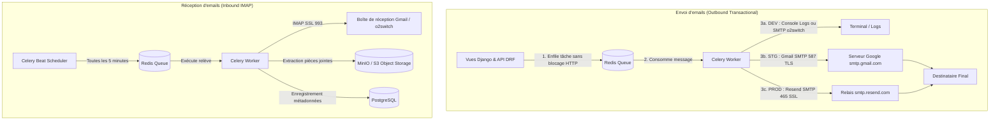

# Architecture & Analyse Technique — Service Mail Multi-Environnement (SMTP, Gmail, Resend & IMAP)

Ce document formalise l'analyse architecturale, technique et sécuritaire pour l'intégration d'un service complet de gestion des emails (envoi sortant & relève entrante IMAP) au sein du projet Cloud-Native `django-postgresql-redis-celery-docker-compose`.

---

## 1. Contexte & Objectifs

Le projet requiert une gestion d'emails adaptée aux spécificités de chaque étape du cycle de vie logiciel :

1. **Développement (DEV)** :
   - **Fallback automatique sur la console Django** (`django.core.mail.backends.console.EmailBackend`) si aucune information SMTP n'est renseignée. Cela permet à un développeur de travailler immédiatement sans dépendance réseau.
   - **Support optionnel d'un serveur SMTP générique** (ex: serveur SMTP mutualisé type o2switch) dès que les variables `SMTP_HOST` et `SMTP_USER` sont définies.
2. **Recette (STAGING)** :
   - Utilisation de **Gmail** via SMTP sécurisé (port 587 TLS ou 465 SSL) avec authentification par **Mot de passe d'application Google (16 caractères)**.
   - Support de la relève de boîte aux lettres via **Gmail IMAP** (port 993 SSL).
   - Permet à l'équipe QA / Métier de tester la vraie délivrabilité, le rendu HTML dans les clients de messagerie et les pièces jointes avec de vraies adresses.
3. **Production (PROD)** :
   - Utilisation de **Resend**, plateforme moderne d'envoi transactionnel d'emails à haute réputation et haute délivrabilité, via son **relais SMTP mondial** (`smtp.resend.com`).
   - Maintien optionnel d'un connecteur IMAP pour la relève automatisée de courriels entrants (ex: traitement de bons de commande, réclamations ou pièces jointes).

---

## 2. Alignement 12-Factor & Bonnes Pratiques Cloud-Native



### 2.1. Facteur III : Configuration dans l'Environnement
Toute la configuration email (hôte, port, utilisateur, chiffrement, drapeaux de sécurité) est strictement découplée du code et injectée via l'environnement (`django-environ`). Aucune valeur secrète n'est codée en dur.

### 2.2. Facteur IV : Services Rattachés (Backing Services)
Le service mail est une ressource externe interchangeable. Passer de Gmail à Resend, ou de Resend à AWS SES / Brevo, ne requiert **aucune modification de code source**, uniquement un changement des variables d'environnement dans Ansible Vault.

### 2.3. Facteur VI : Processus Apatrides & Non-Bloquants (Stateless)
> [!IMPORTANT]
> **Règle absolue** : Aucun envoi d'email ne doit être synchrone dans une vue Django HTTP.
> Une transaction SMTP (handshake TCP, négociation TLS, envoi des commandes RFC 5321) induit une latence réseau oscillant entre 500 ms et 3 000 ms. L'exécution synchrone saturerait immédiatement les workers Gunicorn.
> L'envoi est donc toujours délégué à une **tâche Celery asynchrone** munie d'un mécanisme de retry exponentiel (`autoretry_for=(Exception,)`).

---

## 3. Matrice Comparative et Environnementale

| Paramètre | DEV Lite (Sans config) | DEV Full (Generic SMTP) | STAGING (Gmail Recette) | PRODUCTION (Resend) |
|---|---|---|---|---|
| **Backend Django** | `console.EmailBackend` | `smtp.EmailBackend` | `smtp.EmailBackend` | `smtp.EmailBackend` |
| **Hôte SMTP (`SMTP_HOST`)** | *(vide / non défini)* | `pif.o2switch.net` | `smtp.gmail.com` | `smtp.resend.com` |
| **Port SMTP (`SMTP_PORT`)** | N/A | `465` (SSL) ou `587` (TLS) | `587` (TLS) ou `465` (SSL) | `465` (SSL) ou `587` (TLS) |
| **Protocole Chiffrement** | N/A | `SSL=true` ou `TLS=true` | **`TLS=true, SSL=false`** | **`SSL=true, TLS=false`** |
| **Identifiant (`SMTP_USER`)** | *(vide)* | `dev@awounfouet.com` | `recette.monprojet@gmail.com` | `resend` |
| **Mot de passe (`SMTP_PASSWORD`)** | *(vide)* | Mot de passe de compte dev | **Mot de passe d'application Google (16 car.)** | **Clé d'API Resend (`re_...`)** |
| **Expéditeur par défaut** | `dev-console@localhost` | `dev@awounfouet.com` | `recette.monprojet@gmail.com` | `notifications@mondomaine.com` |
| **Hôte IMAP (`IMAP_HOST`)** | *(vide)* | `pif.o2switch.net` | `imap.gmail.com` | `pif.o2switch.net` ou dédié |
| **Port IMAP (`IMAP_PORT`)** | N/A | `993` (SSL) | `993` (SSL) | `993` (SSL) |

---

## 4. Spécificités d'Authentification : Gmail & Resend

### 4.1. Spécificité Gmail : Google App Passwords (16 caractères)
Depuis mai 2022, Google refuse catégoriquement l'authentification SMTP avec le mot de passe principal d'un compte :
1. La validation en deux étapes (**2FA**) doit être activée sur le compte Google.
2. Un mot de passe d'application dédié doit être généré depuis l'espace de sécurité Google : `https://myaccount.google.com/apppasswords`.
3. Le mot de passe généré est une chaîne de 16 lettres minuscules (ex: `abcd efgh ijkl mnop`).
4. Ce mot de passe d'application est renseigné sans espaces dans `SMTP_PASSWORD` et `IMAP_PASSWORD`.

> [!NOTE]
> **Quotas Gmail** : Les comptes Gmail standards sont limités à 500 emails/jour (2 000 pour Google Workspace), ce qui est largement suffisant pour un environnement de recette.
> **Réécriture d'expéditeur** : Les serveurs SMTP de Gmail réécrivent automatiquement le header `From:` avec l'adresse du compte connecté afin d'éviter l'usurpation d'identité (anti-spoofing).

### 4.2. Spécificité Resend : Relais SMTP Haute Disponibilité
Resend fournit un relais SMTP compatible avec tous les frameworks web :
- **Serveur** : `smtp.resend.com`
- **Port** : `465` (avec SSL) ou `587` (avec STARTTLS)
- **Utilisateur** : Strictement `resend`
- **Mot de passe** : La clé d'API Resend générée sur le dashboard (format `re_123456789_abcdefghijklmnopqrstuv`)
- **Domaine vérifié** : En production, l'adresse d'expédition (`DEFAULT_FROM_EMAIL`) doit appartenir à un domaine ayant ses enregistrements DNS SPF/DKIM validés sur Resend.

---

## 5. Architecture Logicielle Proposée

### 5.1. Module de Configuration Dynamique (`config/settings/email.py`)

Ce module applique le principe de **tolérance et fallback en DEV** opposé à la **rigueur fail-fast en STAGING et PRODUCTION** :

```python
"""Module de politique et configuration Email / IMAP."""
import logging
from django.core.exceptions import ImproperlyConfigured
from environ import Env

logger = logging.getLogger(__name__)

def configure_email_settings(env: Env) -> dict:
    app_env = env("APPLICATION_ENV", default="dev").lower()
    
    smtp_host = env("SMTP_HOST", default="").strip()
    smtp_user = env("SMTP_USER", default="").strip()
    smtp_password = env("SMTP_PASSWORD", default="").strip()

    # 1. Fallback DEV : Console automatique si non renseigné
    if app_env == "dev":
        if not smtp_host or not smtp_user:
            logger.info("DEV: SMTP_HOST/SMTP_USER non configurés -> Activation automatique du Console EmailBackend")
            return {
                "EMAIL_BACKEND": "django.core.mail.backends.console.EmailBackend",
                "DEFAULT_FROM_EMAIL": "dev-console@localhost",
                "IMAP_HOST": "",
                "IMAP_PORT": 993,
                "IMAP_USER": "",
                "IMAP_PASSWORD": "",
                "IMAP_USE_SSL": True,
            }

    # 2. Règle stricte en Staging et Production
    if app_env in ("stg", "prod"):
        missing = [
            var for var, val in [
                ("SMTP_HOST", smtp_host),
                ("SMTP_USER", smtp_user),
                ("SMTP_PASSWORD", smtp_password),
            ] if not val
        ]
        if missing:
            raise ImproperlyConfigured(
                f"Configuration SMTP incomplète en {app_env}. Variables obligatoires manquantes : {', '.join(missing)}"
            )

    # 3. Configuration SMTP effective
    use_tls = env.bool("SMTP_USE_TLS", default=False)
    use_ssl = env.bool("SMTP_USE_SSL", default=True)
    default_port = 587 if use_tls else 465
    smtp_port = env.int("SMTP_PORT", default=default_port)

    return {
        "EMAIL_BACKEND": "django.core.mail.backends.smtp.EmailBackend",
        "EMAIL_HOST": smtp_host,
        "EMAIL_PORT": smtp_port,
        "EMAIL_HOST_USER": smtp_user,
        "EMAIL_HOST_PASSWORD": smtp_password,
        "EMAIL_USE_TLS": use_tls,
        "EMAIL_USE_SSL": use_ssl,
        "EMAIL_TIMEOUT": env.int("SMTP_TIMEOUT", default=10),
        "DEFAULT_FROM_EMAIL": env("DEFAULT_FROM_EMAIL", default=smtp_user),
        # Paramètres IMAP pour la lecture asynchrone
        "IMAP_HOST": env("IMAP_HOST", default=""),
        "IMAP_PORT": env.int("IMAP_PORT", default=993),
        "IMAP_USER": env("IMAP_USER", default=smtp_user),
        "IMAP_PASSWORD": env("IMAP_PASSWORD", default=smtp_password),
        "IMAP_USE_SSL": env.bool("IMAP_USE_SSL", default=True),
        "IMAP_MAILBOX": env("IMAP_MAILBOX", default="INBOX"),
    }
```

### 5.2. Intégration dans `config/settings/base.py`

```python
from .email import configure_email_settings

# Application des paramètres d'email
_email_conf = configure_email_settings(env)
for _key, _val in _email_conf.items():
    globals()[_key] = _val
```

---

## 6. Traitement Asynchrone Celery & Intégration S3

### 6.1. Tâche d'Envoi Sortant (`send_email_async`)
- Prise en charge des retries exponentiels en cas d'erreur de socket ou d'authentification temporaire (`max_retries=5`, `retry_backoff=True`).
- Support des pièces jointes optionnelles transmises par leur chemin dans `default_storage` (S3/MinIO).

### 6.2. Tâche de Relève Entrante IMAP (`check_incoming_emails_imap`)
- Connecte le worker à la boîte IMAP (`imap.gmail.com:993` en recette ou `pif.o2switch.net:993`).
- Recherche les messages non lus (`UNSEEN`).
- Extrait les pièces jointes éventuelles et les transfère immédiatement vers le stockage d'objets via `default_storage.save("inbox_attachments/...", content)`.
- **Aucun volume disque partagé** : le fichier est stocké sur MinIO ou S3 et accessible immédiatement par l'ensemble des conteneurs de la flotte.

---

## 7. Sécurité & Gestion des Secrets Ansible Vault

### 7.1. Fichiers `.env.*.example`

- **`.env.dev.example`** : Les lignes SMTP restent commentées par défaut. Dès qu'un développeur souhaite tester un vrai envoi, il décommente et renseigne ses identifiants.
- **`.env.stg.example`** : Présente les variables pré-configurées pour Gmail (`smtp.gmail.com`, port 587, TLS=true) avec les marqueurs `CHANGE_ME_GMAIL_APP_PASSWORD`.
- **`.env.prod.example`** : Présente les variables pré-configurées pour Resend (`smtp.resend.com`, port 465, SSL=true, user `resend`) avec `CHANGE_ME_RESEND_API_KEY`.

### 7.2. Chiffrement Ansible Vault (`inventories/*/group_vars/vault.yml`)

Les mots de passe réels ne figurent jamais dans Git :
```yaml
# inventories/stg/group_vars/vault.yml (chiffré)
vault_smtp_host: "smtp.gmail.com"
vault_smtp_port: 587
vault_smtp_user: "recette.dst.projet@gmail.com"
vault_smtp_password: "abcdefghijklmnop"     # Mot de passe d'application Google
vault_smtp_use_tls: true
vault_smtp_use_ssl: false

# inventories/prod/group_vars/vault.yml (chiffré)
vault_smtp_host: "smtp.resend.com"
vault_smtp_port: 465
vault_smtp_user: "resend"
vault_smtp_password: "re_123456789_abcdefghijklmnopqrstuv" # Clé Resend
vault_smtp_use_tls: false
vault_smtp_use_ssl: true
```

Le template Ansible `roles/compose_stack/templates/runtime.env.j2` génère ensuite le fichier `.env.runtime` sur l'hôte cible avec les permissions étanches `0600 root:root`.

---

## 8. Matrice de Tests & Plan de Qualification

1. **Test unitaire DEV Fallback Console** :
   - Initialiser Django sans `SMTP_HOST` ni `SMTP_USER`.
   - Vérifier que `settings.EMAIL_BACKEND == "django.core.mail.backends.console.EmailBackend"`.
   - Simuler un `send_mail` et vérifier qu'aucune exception n'est levée et que l'email est dirigé vers la sortie standard.
2. **Test unitaire DEV avec Generic SMTP** :
   - Fournir des variables de test fictives.
   - Vérifier que `settings.EMAIL_BACKEND == "django.core.mail.backends.smtp.EmailBackend"`.
3. **Test unitaire STAGING / PROD Fail-Fast** :
   - Tester l'absence de `SMTP_PASSWORD` en environnement `stg` ou `prod`.
   - Vérifier que Django lève immédiatement `ImproperlyConfigured`.
4. **Test de la Tâche Celery avec Mock** :
   - Exécuter `send_email_async.run(...)` avec mock de `send_mail`.
   - Vérifier le statut de succès et le comptage des destinataires.
5. **Scanner Anti-Fuite (`secret_hygiene.py`)** :
   - Valider que les clés d'API Resend ou mots de passe Google ne sont jamais écrits en clair et respectent les filtres du scanner.
